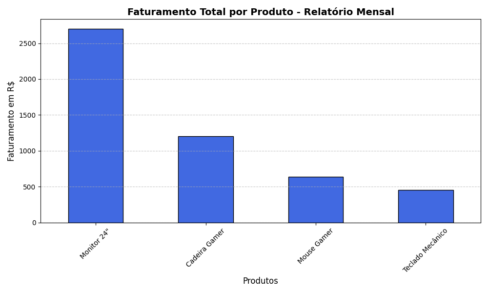

# 📊 Analisador de Vendas Automático & Data Visualization

Este projeto simula uma solução de inteligência de negócios (BI) desenvolvida em **Python** para resolver um problema comum em empresas: a lentidão no processamento e análise de relatórios mensais de faturamento.

A ferramenta automatiza a leitura de dados brutos, realiza o tratamento/cálculo de indicadores financeiros e gera relatórios visuais prontos para apresentações executivas em menos de um segundo.

## ⚙️ Tecnologias Utilizadas
* **Python 3.x**
* **Pandas**: Manipulação, limpeza e agregação de dados.
* **Matplotlib**: Geração de gráficos e *Data Visualization*.

## 📈 Resultados e Insights Gerados
O script processa a base de dados e gera automaticamente:
1. **Métricas de Faturamento**: Cálculo instantâneo do faturamento bruto por pedido.
2. **Visão por Produto**: Agrupamento (`groupby`) e ordenação dos produtos que geram maior receita para a companhia.
3. **Gráfico Executivo**: Exportação automática de um gráfico de barras profissional em formato `.png`.

### 📊 Visualização do Painel de Vendas
Aqui está o gráfico gerado automaticamente pelo script:

## 🧠 Conceitos Aplicados
* **Dataframes**: Estruturação de dados tabulares em memória.
* **Agregação e Vetorização**: Eliminação de loops manuais substituindo-os por operações matemáticas vetorizadas do Pandas, otimizando a performance.
* **Ajuste de Eixos e Layout**: Rotação de labels e aplicação de grids para facilitar a leitura dos dados (*Data Storytelling*).
